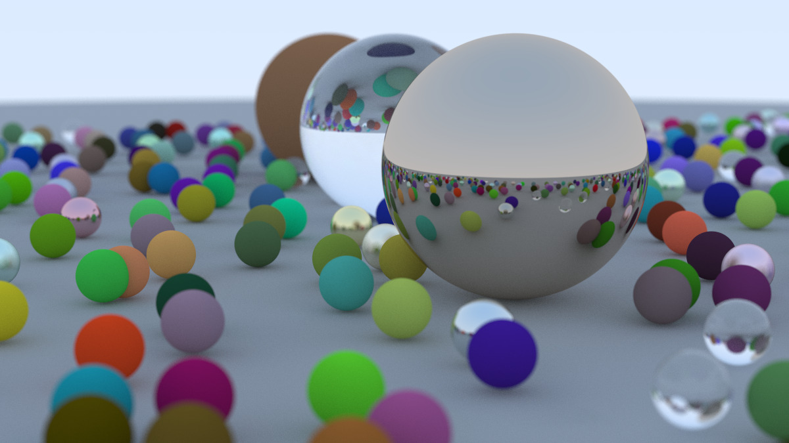
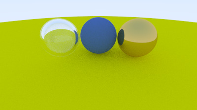

# Ray Tracer

A ray tracer engine implementation in Java.

## Overview

This project is a complete implementation of a ray tracer capable of rendering photorealistic images with:
- **Multiple material types**: Diffuse (material.Lambertian), metal with adjustable fuzziness, and glass with refraction
- **Advanced camera features**: Positionable camera, adjustable field of view, and depth-of-field effects
- **Physically accurate lighting**: Recursive ray tracing with configurable bounce depth
- **Antialiasing**: Multiple samples per pixel for smooth edges

**Note**: While the original tutorial uses C++, this implementation is written entirely in **Java**, demonstrating the concepts are language-agnostic.

## Credit

This project is based on:
- **"Ray Tracing in One Weekend"** by Peter Shirley
- Tutorial available at: https://raytracing.github.io/books/RayTracingInOneWeekend.html
- All ray tracing algorithms and mathematical foundations from the tutorial
- Implementation translated from C++ to Java

## Gallery

### High Quality Render


*Glass, diffuse, and metal materials with depth of field. This image took 45 minutes to render on my machine with the following camera settings.*
```java
        Camera cam = new Camera();

        cam.aspectRatio = 16.0 / 9.0;
        cam.imageWidth = 1200;
        cam.setSamplesPerPixel(500);
        cam.maxDepth = 50;

        cam.setVerticalFov(20);
        cam.setLookFrom(new Vec3(13, 2, 3));
        cam.setLookAt(new Vec3(0, 0, 0));
        cam.setvUp(new Vec3(0, 1, 0));

        cam.setDeFocusAngle(0.6);
        cam.setFocusDist(10.0);

        cam.render(world);
```
Post optimization and parallelism implementation in render method, now the same image can be generated in 20 minutes with the above settings.

### Simple Scene


*Basic scene with 3 spheres demonstrating 3 different materials (glass, metal and material.Lambertian respectively from left to right).*

## Features

### Materials
- **material.Lambertian (Diffuse)**: Matte surfaces that scatter light randomly
- **material.Metal**: Reflective surfaces with adjustable fuzziness/roughness
- **material.Dielectric (Glass)**: Transparent materials with refraction, total internal reflection, and Schlick's approximation

### core.Camera
- **Positionable camera** with three key vectors:
   - **`lookfrom`**: core.Camera position in 3D space.
      - This is a vector with x, y and z coordinates for camera placement.
      - Example: `lookfrom = (13, 2, 3)` places camera 13 units right, 2 units up, 3 units forward

   - **`lookat`**: Target point the camera aims at
      - Controls *what* the camera is looking at
      - Example: `lookat = (0, 0, 0)` aims camera at the origin (center of scene)
      - The camera will always point toward this location, keeping it in the center of the frame
      - Change from `(0, 0, 0)` to `(4, 1, 0)` to focus on the right metal sphere instead

   - **`vup`**: "View up" vector (camera orientation and rotation along the axis between `lookfrom` and `lookat`)
      - Controls the camera's *roll* or tilt (which way is "up")
      - Example: `vup = (0, 1, 0)` keeps the horizon level (Y-axis is up)
      - Typically set to `(0, 1, 0)` for normal upright orientation
      - Change to `(0, 0, 1)` or `(1, 0, 0)` to tilt the camera on its side for artistic effects

- Adjustable **vertical field of view (FOV)**
   - `vfov = 90`: Wide-angle view (see more of the scene)
   - `vfov = 20`: Telephoto/zoomed-in view (see less, but larger)

- **Depth of field (defocus blur)** with configurable aperture and focus distance
   - `defocusAngle = 0`: Everything sharp (infinite depth of field, like a pinhole camera)
   - `defocusAngle = 10.0`: Strong blur (shallow depth of field, like portrait mode)
   - `focusDist = 10.0`: Objects 10 units from camera are in sharp focus, others are blurred
- Adjustable vertical field of view (FOV)
- Depth of field (defocus blur) with configurable aperture and focus distance

### Rendering
- Configurable image resolution
- Antialiasing with adjustable samples per pixel
- Recursive ray tracing with configurable maximum depth
- PPM image format output

## Project Structure
```
src/
├── Main.java                          # Entry point and scene setup
│
├── core/                              # Core ray tracing components
│   ├── Camera.java                    # Camera and rendering logic
│   ├── Ray.java                       # Ray representation
│   └── Interval.java                  # Range/interval utilities
│
├── math/                              # Mathematical utilities
│   ├── Vec3.java                      # 3D vector operations
│   └── Utils.java                     # Random numbers and constants
│
├── geometry/                          # Geometric primitives
│   ├── Hittable.java                  # Interface for hittable objects
│   ├── HitRecord.java                 # Intersection data
│   ├── HittableList.java              # Object collection
│   └── Sphere.java                    # Sphere primitive
│
├── material/                          # Material implementations
│   ├── Material.java                  # Abstract material base
│   ├── ScatterRecord.java             # Scatter result data
│   ├── Lambertian.java                # Diffuse/matte material
│   ├── Metal.java                     # Reflective material
│   └── Dielectric.java                # Glass/transparent material
│
└── rendering/                         # Rendering utilities
    └── Color.java                     # Color output and conversion
```
## Running in IntelliJ IDEA

### Prerequisites
- **Java JDK**: Version 11 or higher
- **IntelliJ IDEA**: Community or Ultimate Edition

### Setup Steps

1. **Clone or download** this project
2. **Open IntelliJ IDEA**
3. **Open the project**: `File → Open` and select the project directory
4. **Wait for indexing** to complete
5. **Run the project**:
    - Right-click on `Main.java`
    - Select `Run 'Main.main()'`
    - Or use the green play button in the top-right corner

### Output

The rendered image will be saved as `image.ppm` in the project root directory.

To view the PPM file:
- You can use any PPM image viewer of your choice. I used https://bytes.usc.edu/~saty/tools/PGMViewer/viewer.html.

## Run using Command Line
After cloning the repository, please follow the following steps.
#### Compilation Steps

1. **Navigate to project directory:**
```bash
   cd path/to/java-raytracer
```

2. **Create output directory for compiled classes:**
This is where .class files (compiled source code) will live.
```bash
   mkdir -p out
```

3. **Compile all Java files:** ..into the newly created out folder.
```bash
   javac -d out src/*.java
```

4. **Run the program:**
```bash
   java -cp out Main
```

5. **Wait for rendering to complete** - Watch console for progress updates

6. **Find your rendered image** - `image.ppm` will be created in the project root

## Configuration Guide

### Quick Rendering (For Testing)

For fast renders during development or testing:

```java
import core.Camera;// In Main.java
Camera cam = new Camera();
cam.aspectRatio =16.0/9.0;
cam.imageWidth =400;              // Low resolution
cam.setSamplesPerPixel(10);        // Few samples (noisy but fast)

cam.maxDepth = 10;                 // Fewer bounces

// Fewer spheres
        for(int a = -5; a< 5; a++) {     // 10×10 grid instead of 22×22
            for(int b = -5; b< 5; b++) {
            // ...
            }
        }
```

**Estimated time**: 1-2 minutes  
**Quality**: Noisy, suitable for testing

---

### Medium Quality

Balanced quality and render time:

```java
import core.Camera;

Camera cam = new Camera();
cam.imageWidth = 800;              // Medium resolution (800×450)
cam.setSamplesPerPixel(100);       // Better antialiasing

cam.maxDepth = 50;                 // Full bounce depth
```

**Estimated time**: 5-15 minutes  
**Quality**: Good.

---

### High Quality (Final Render)

Maximum quality as shown in the tutorial:

```java
import core.Camera;

Camera cam = new Camera();
cam.imageWidth = 1200;             // High resolution (1200×675)
cam.setSamplesPerPixel(500);       // Smooth, minimal noise

cam.maxDepth = 50;                 // Full bounce depth
```

**Estimated time**: 20-30 minutes (depends on CPU)
**Quality**: Excellent.

---

### Scene Complexity

#### Simple Scene (Few Spheres)

```java
// Comment out the random sphere generation loop
// Keep only the 3 large feature spheres

import geometry.Sphere;
import math.Vec3;

world.add(new Sphere(new Vec3(0, 1,0), 1.0,material1));      // Glass
world.add(new Sphere(new Vec3(-4, 1,0), 1.0,material2));     // Brown
world.add(new Sphere(new Vec3(4, 1,0), 1.0,material3));      // material.Metal
```

**Spheres**: 4 (including ground)  
**Render time**: Very fast

#### Medium Scene
```java
for (int a = -5; a < 5; a++) {         // 10×10 grid = 100 spheres
    for (int b = -5; b < 5; b++) {
```

**Spheres**: ~100  
**Render time**: Moderate

#### Full Scene (Tutorial Default)
```java
for (int a = -11; a < 11; a++) {       // 22×22 grid = ~484 spheres
    for (int b = -11; b < 11; b++) {
```

**Spheres**: ~484  
**Render time**: Long but creates the iconic cover image

---

## Performance Tips

1. **Start small**: Please test with low resolution and few samples first
2. **Monitor progress**: Watch the console for "Scanlines remaining" updates

## Example Configurations

### Configuration 1: Quick Test
```java
cam.imageWidth = 400;
cam.setSamplesPerPixel(10);
// 10×10 sphere grid
// Time: ~1 minute
```

### Configuration 2: Preview
```java
cam.imageWidth = 800;
cam.setSamplesPerPixel(50);
// 15×15 sphere grid
// Time: ~5 minutes
```

### Configuration 3: Final Render
```java
cam.imageWidth = 1200;
cam.setSamplesPerPixel(500);
// 22×22 sphere grid
// Time: ~30-60 minutes
```

## Troubleshooting

### Render Taking Too Long
- Reduce `imageWidth` to 400-600
- Reduce `samplesPerPixel` to 10-50
- Reduce sphere count in the loops

## Technical Details

### Rendering Algorithm

The ray tracer uses a **parallel, physically-based rendering pipeline**:

1. **Initialization Phase**
    - Camera calculates viewport dimensions based on field of view and aspect ratio
    - Constructs orthonormal basis vectors (u, v, w) for camera orientation
    - Pre-computes pixel spacing and defocus disk parameters

2. **Parallel Ray Tracing Phase** (Multi-threaded)
    - Image rows are processed in parallel across multiple CPU cores
    - For each pixel:
        - Shoots `samplesPerPixel` rays with random offsets within the pixel (antialiasing)
        - Each ray originates from a random point on the defocus disk (depth of field)
        - Ray direction determined by pixel position on viewport
    - This change caused runtime reduction by 50%

3. **Recursive Ray Bouncing**
    - Each ray bounces recursively up to `maxDepth` times (controlled in `core/Camera.java`)
    - At each surface intersection:
        - Material's `scatter()` method determines reflection/refraction direction
        - Ray color is attenuated by material's albedo (surface color)
    - Base case: Ray exceeds max depth (returns black) or misses all objects (returns sky gradient)

4. **Color Accumulation**
    - Rays accumulate color from:
        - **Material interactions**: Diffuse scattering, metallic reflections, glass refraction
        - **Sky gradient**: Blue-white gradient based on ray direction
    - Colors are multiplied along the bounce path (e.g., red surface × blue light = dark red)

5. **Pixel Finalization**
    - Final pixel color = average of all sample colors
    - Applied formula: `pixelColor = (sum of all sample colors) / samplesPerPixel`
    - Colors are gamma-corrected and clamped to [0, 255] range for PPM output

6. **File Writing Phase**
    - All computed pixels written sequentially to PPM file
    - Format: Plain text RGB values (P3 PPM format)

### Performance Optimization

The renderer uses **Java parallel streams** to distribute row rendering across CPU cores:
- Single-level parallelization (rows only, not samples)
- Automatic load balancing across available processors
- Typical speedup: **4-8x faster** than sequential rendering
- Memory efficient: Pre-allocates pixel array, minimal garbage collection

### Materials Math
- **material.Lambertian**: Cosine-weighted hemisphere sampling
- **material.Metal**: Perfect reflection with optional random fuzz
- **material.Dielectric**: Snell's law refraction + Schlick's approximation for reflectance. The equations are inside the article. :)

### core.Camera Model
- Thin lens approximation for depth of field
- Rays originate from random points on defocus disk
- Viewport positioned at focus distance

## License

This project follows the original tutorial's spirit of education and learning. The algorithms and concepts are from Peter Shirley's "core.Ray Tracing in One Weekend" book.

## Author

Java implementation by Usman (2025)  
Based on Peter Shirley's C++ tutorial

---

